# githubactions-v2

[Gitub-repo](https://github.com/sidd-harth/solar-system)

- Workflow > job > steps


# Syntax

- There are some pre-built actions, some of them are verified and some others from community.

    

- Artifacts:

    ```yaml        
    - uses: actions/upload-artifact@v7
        with:
        name: my-hello-artifact
        path: hello.txt 
    ```

    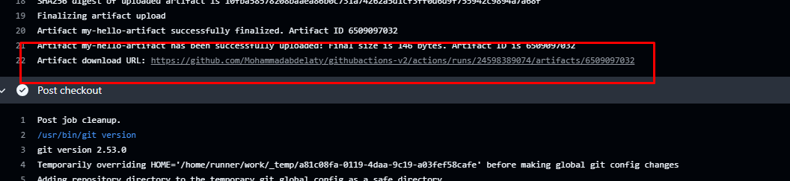

    - or to downlaod it from here

        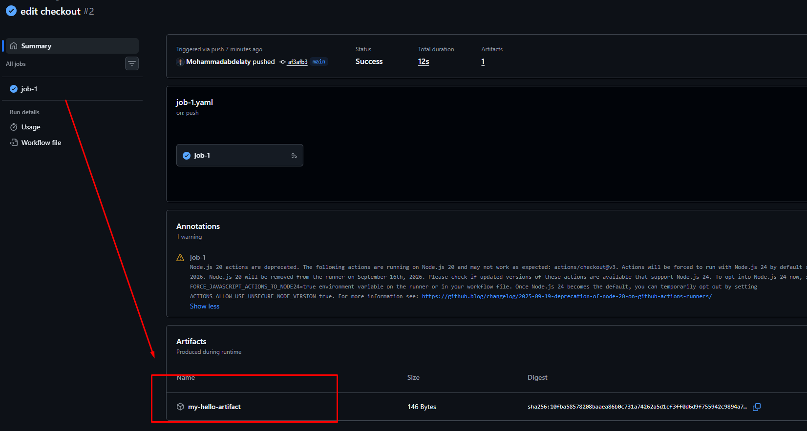

    - To use in later jobs you need to donwload it and make the second job depends on the first one.

        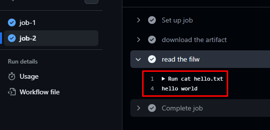

    - Usually artifacts stays for 90 days retention

        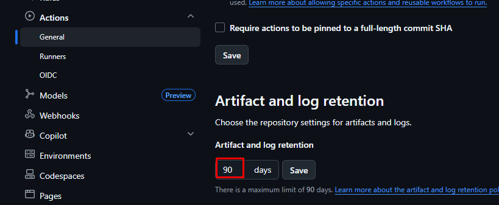 

- Variables:

    - You can use variabels in 2 ways:

        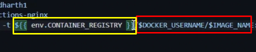
    
    - we can keep env: variable in root level so all jobs can access them

- Secret variables:

    - As in gitlab you can keep the secrets in repo settieng on environment or repository levels:

        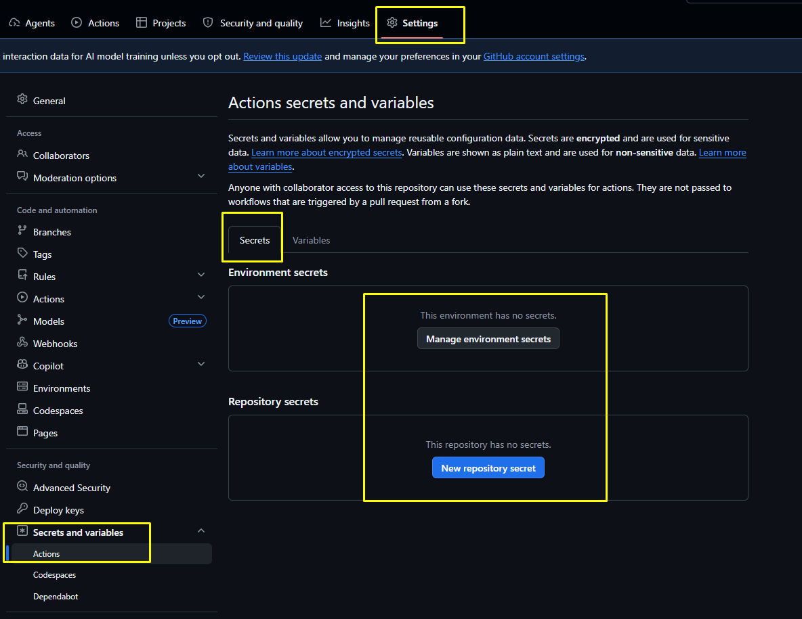
    
    - in this case we use `${{ secret.DOCKER_PASSWORD}}`, this secret is withing the same environment not repo level

        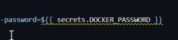

        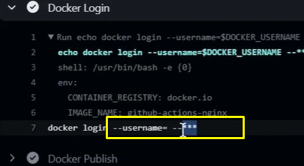

    - Incase of repo veriables, `${{ vars.DOCKER_USERNAME }}`  

        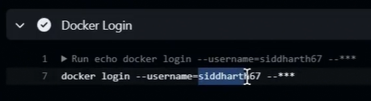

### Demos
- [variables-repo](https://github.com/Mohammadabdelaty/github-actions-variables)
- [simple](https://github.com/Mohammadabdelaty/github-actions-lab1-q1)
- [artifacts](https://github.com/Mohammadabdelaty/github-actions-artifacts-hands-on)


## Jobs

- Trigger `workflow_dispatch` lets you run it manually

    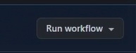

- Concurrency, usually should be disabled if not needed, to reduce resources, it can on jos or workflow levels

    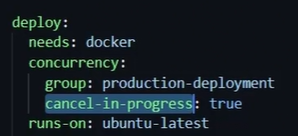

    - so the higher priotiy will get in

        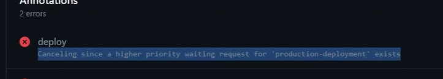

    - If we set the arg to false it put the second workflow/job in queue

        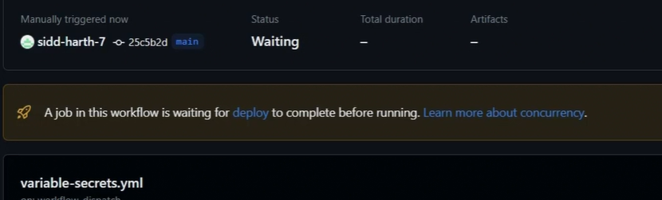

- Timeout: incase of mistakenly long runing job will consume alot of time and money, you can set a `timeout-minutes`:

    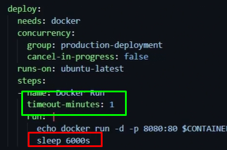    

    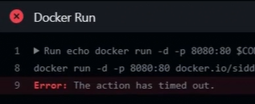

- matrix strategy: we can run the job with multiple images on multiple runners in parallel 

    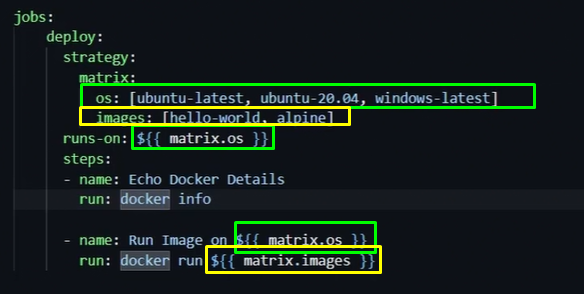

    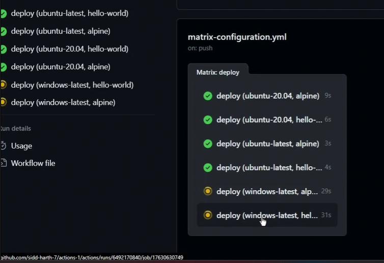

    - Some of it will fail as alpine won't work with amd windows so we execlud it and include some other image for ubuntu, also disable `fail-fast` and allow maximum 2 parallel jobs.

        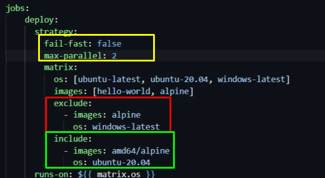

- runner-context: it show default variables in the repo which can be used (same as gitlab) in as expression for conditions

    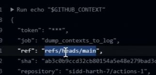

- expression: we use the conext in condition as follows

    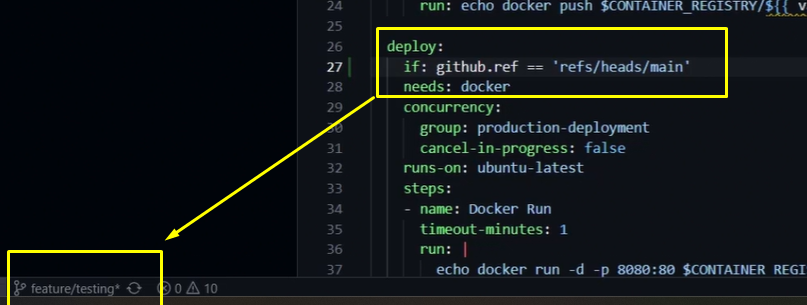

    - This will skip this job if not in main branch using the expression

        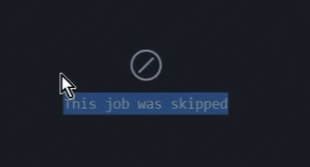

- event filter: used in cases like trigger the workflow in a specific condition

    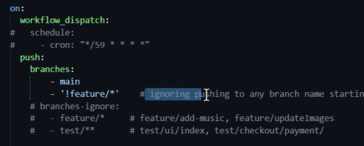

    - It also can be done for pull-requests

        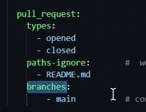

    - some use cases require to run specific workflow as a check for a feature so it can be done only with pull request, whatever this request is open or closed 

    - Skip the workflow
        - [skip ci], [ci skip], [action skip], [skip action]

## Nodejs Pipeline

    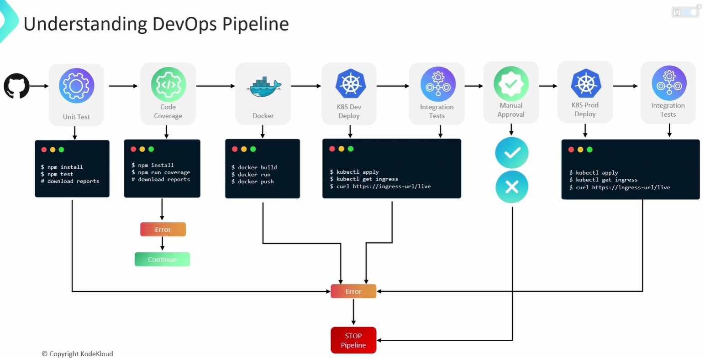

## Exeprission for code coverage error

    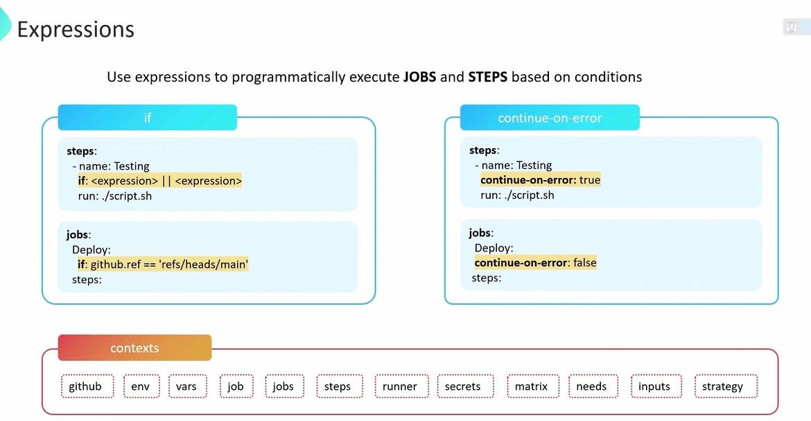

- We may need to use condition in code coverage use case to keep going with the workflow even i didn't meet the threshold

    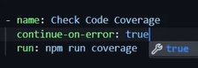

    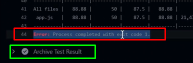

- Also we can use `if` condition, usecase is that if there is a failure in one step and the next step uploads artifacts so to shw why eror happens, we need to use context as well for a step

    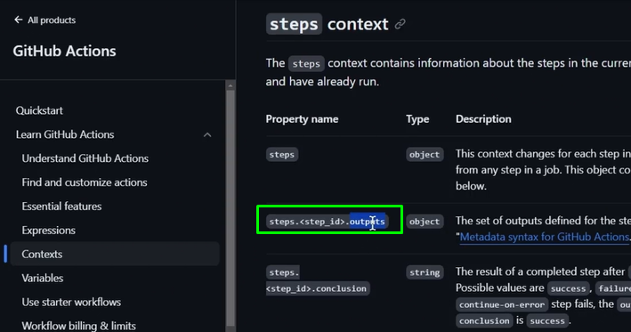

    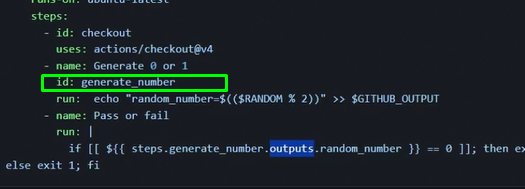

    - Or, we can use a pre-confiugred expression ready 

        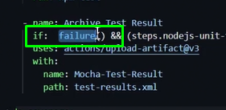

    - The above `failure()` describes the status of the previous step

    - But the best practice in this case is to use `always()`, we need it to run it whether the previous one worked or not

        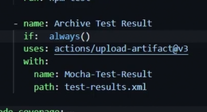


#### Demo to be done

```
Navigate to your GitHub account and use github-actions-solar-system repository within feature/workflow branch
Explore and modify the workflow file named solar-system.yml

Do the following
Append a new job with id as code-coverage,
a. This job should execute on this operating system - ubuntu-latest
b. Add following steps
Step 1 - use an action to checkout the repository
Step 2 - use actions/setup-node action to setup NodeJS of version 18
Step 3 - Install NodeJS dependencies
Step 4 - Run Code-coverage command (npm run code-coverage)
This step may fail, configure the step to prevent the job from failing when this step fails.
Step 5 - Upload code-coverage reports using upload-artifact action with the below
config
- name: Code-Coverage-Result
- path: coverage
- retention-days: 5

Both the unit-testing and code-coverage jobs should run in parallel.
```