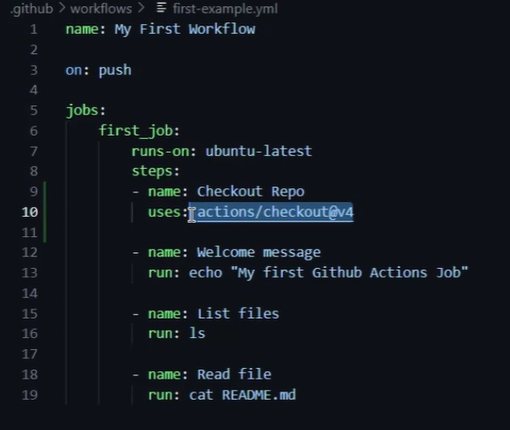

# githubactions-v2

[Gitub-repo](https://github.com/sidd-harth/solar-system)

- Workflow > job > steps

- There are some pre-built actions, some of them are verified and some others from community.

    

