# githubactions-v2

[Gitub-repo](https://github.com/sidd-harth/solar-system)

- Workflow > job > steps


# Syntax

- There are some pre-built actions, some of them are verified and some others from community.

    

- Artifacts:

    ```yaml        
    - uses: actions/upload-artifact@v7
        with:
        name: my-hello-artifact
        path: hello.txt 
    ```

    

    - or to downlaod it from here

        

    - To use in later jobs you need to donwload it and make the second job depends on the first one.

        

    - Usually artifacts stays for 90 days retention

         

- Variables:

    - You can use variabels in 2 ways:

        
    
    - we can keep env: variable in root level so all jobs can access them

- Secret variables:

    - As in gitlab you can keep the secrets in repo settieng on environment or repository levels:

        
    
    - in this case we use `${{ secret.DOCKER_PASSWORD}}`, this secret is withing the same environment not repo level

        

        

    - Incase of repo veriables, `${{ vars.DOCKER_USERNAME }}`  

        

### Demos
- [variables-repo](https://github.com/Mohammadabdelaty/github-actions-variables)
- [simple](https://github.com/Mohammadabdelaty/github-actions-lab1-q1)
- [artifacts](https://github.com/Mohammadabdelaty/github-actions-artifacts-hands-on)


## Jobs

- Trigger `workflow_dispatch` lets you run it manually

    

- Concurrency, usually should be disabled if not needed, to reduce resources, it can on jos or workflow levels

    

    - so the higher priotiy will get in

        

    - If we set the arg to false it put the second workflow/job in queue

        

- Timeout: incase of mistakenly long runing job will consume alot of time and money, you can set a `timeout-minutes`:

        

    

- matrix strategy: we can run the job with multiple images on multiple runners in parallel 

    

    

    - Some of it will fail as alpine won't work with amd windows so we execlud it and include some other image for ubuntu, also disable `fail-fast` and allow maximum 2 parallel jobs.

        

- runner-context: it show default variables in the repo which can be used (same as gitlab) in as expression for conditions

    

- expression: we use the conext in condition as follows

    

    - This will skip this job if not in main branch using the expression

        

- event filter: used in cases like trigger the workflow in a specific condition

    

    - It also can be done for pull-requests

        

    - some use cases require to run specific workflow as a check for a feature so it can be done only with pull request, whatever this request is open or closed 

    - Skip the workflow
        - [skip ci], [ci skip], [action skip], [skip action]

## Nodejs Pipeline

    

## Exeprission for code coverage error

    

- We may need to use condition in code coverage use case to keep going with the workflow even i didn't meet the threshold

    

    

- Also we can use `if` condition, usecase is that if there is a failure in one step and the next step uploads artifacts so to shw why eror happens, we need to use context as well for a step

    

    

    - Or, we can use a pre-confiugred expression ready 

        

    - The above `failure()` describes the status of the previous step

    - But the best practice in this case is to use `always()`, we need it to run it whether the previous one worked or not

        


#### Demo to be done

```
Navigate to your GitHub account and use github-actions-solar-system repository within feature/workflow branch
Explore and modify the workflow file named solar-system.yml

Do the following
Append a new job with id as code-coverage,
a. This job should execute on this operating system - ubuntu-latest
b. Add following steps
Step 1 - use an action to checkout the repository
Step 2 - use actions/setup-node action to setup NodeJS of version 18
Step 3 - Install NodeJS dependencies
Step 4 - Run Code-coverage command (npm run code-coverage)
This step may fail, configure the step to prevent the job from failing when this step fails.
Step 5 - Upload code-coverage reports using upload-artifact action with the below
config
- name: Code-Coverage-Result
- path: coverage
- retention-days: 5

Both the unit-testing and code-coverage jobs should run in parallel.
```

## Caching dependencies 

- Caching vs artifacts
    - Caching: re-use files that don't change between jobs.
    - Artifacts: Stors files that will be used between jobs.

- So we specify the path that files will be stored in, then a `key` for it.
    - This `key uses hash` for a file that is needed to be cached as if it's re-written, if this hash changes, so we get the new file or update.

    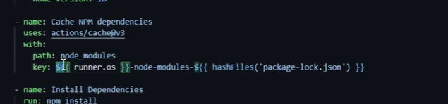

    - this is in 1st start

    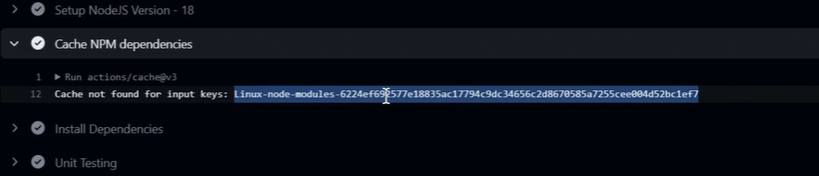

    - this is when we run the workflow for the next time

    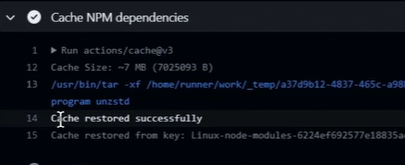

    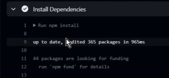

- This example above shows another difference between caching and artifacts,
    - artifacts are not available for the next running workflow, but the

- You need to add the cache step in the 2 jobs in the same workflow with the same key before installation step.

## Doecker, push and test

### Dockerhub

- Only build and test for now

    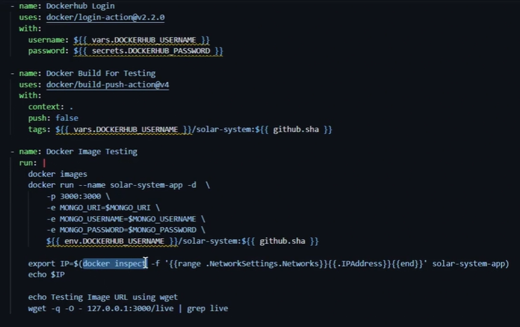

- To push, add the build push again but with `true` value for the `push` arg.

    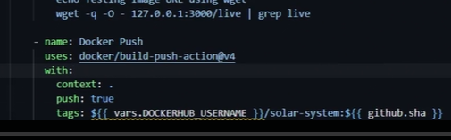

### GHCR

- Login

    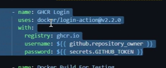

- Push:
    - 1st one is for doackerhub
    - snd is for ghcr

    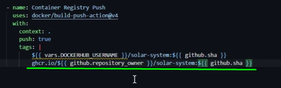

> No need to add `GITHUB_TOKEN` as a secret.

- The github tocken needs to have the read/write permission

    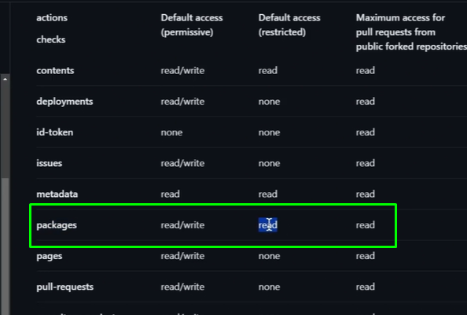

- So we add the permission: wrtie to the packages

    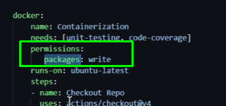

    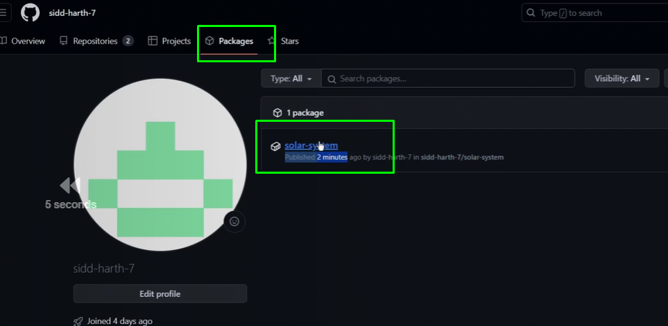

## Job and service containers

- There was an issue with accessing the mongodb database, slow, so they've decideed to run similar db as a `service container` and the nodejs in `job container` to handl testing and installing dependancies while testing the app to be faster

    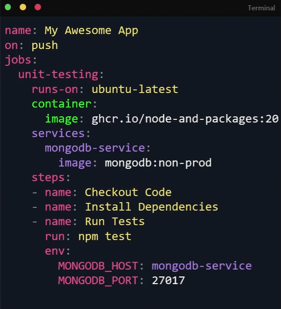

    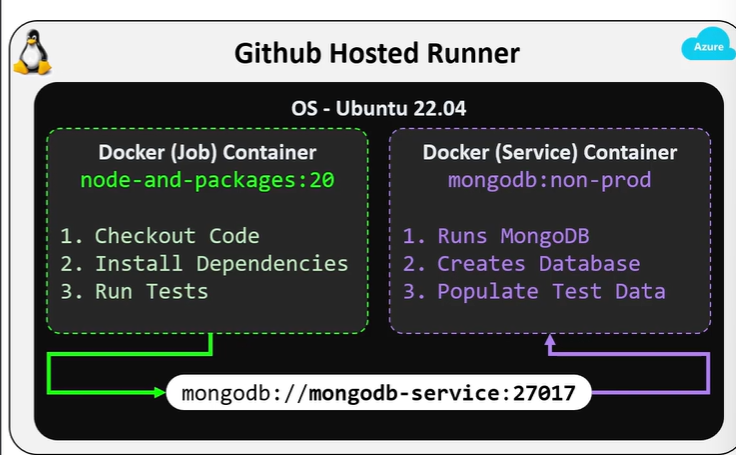

    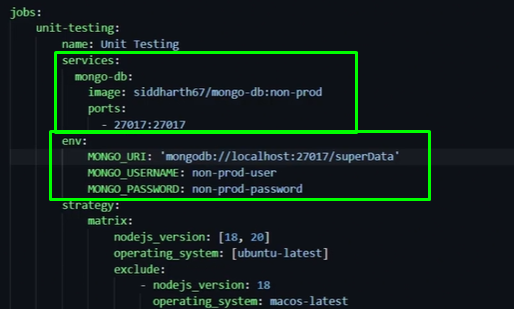

- We'll run code coverage in a job container as well but at this time it needs to access the mongodb serverce no using the `localhost` as the last job, in needs a name -all containers by default are in a brige network- we name it mongo

    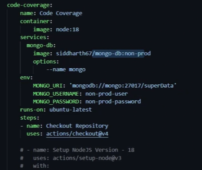

    - and change the mongodb url env variable

## Demo

Navigate to your GitHub account and use github-actions-solar-system repository within feature/workflow branch
Explore and modify the workflow file named solar-system.yml

Do the following:
Modify the job with id as unit-testing,
a. This job should make use of a container to run all the steps
Container image - node:20
The Setup Node.js Version step should be commented out because Node.js is already available in the container
b. Commit the changes and checkout the workflow execution

## Kubernetes deployment

- We need kubectl installation step by azure
- keep kube config file as a repo secret
- use `kuberenetes set context` by azure.

    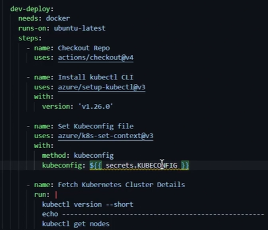

- keep variable inside manifest yaml files as follows `_{_NAMESPACE_}_`

    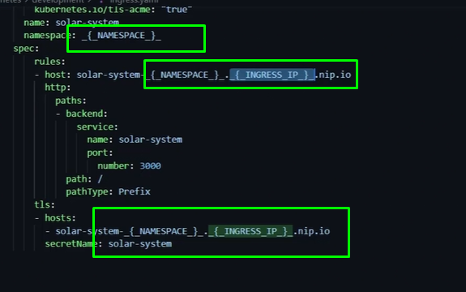

- Add repo variable with name `NAMESPACE`
- Then replace it with `cschleiden/replace-token@v1`

    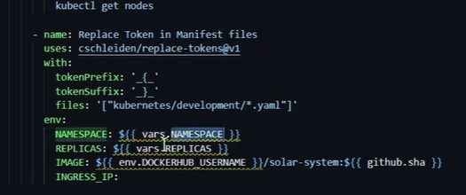

- Another step for setting the `INGRESS_IP` variable >> `env.GITHUB` and make it available for next steps.

    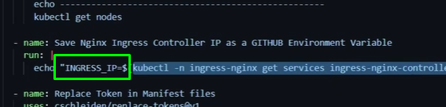

    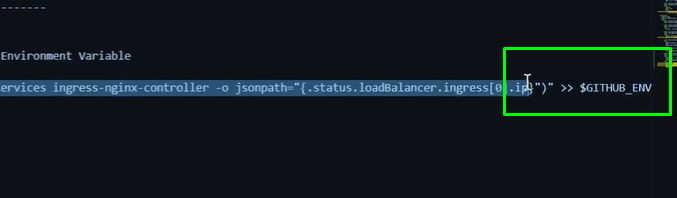

    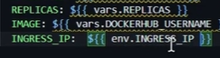

- Then create a secret with mongodb data and deploy

    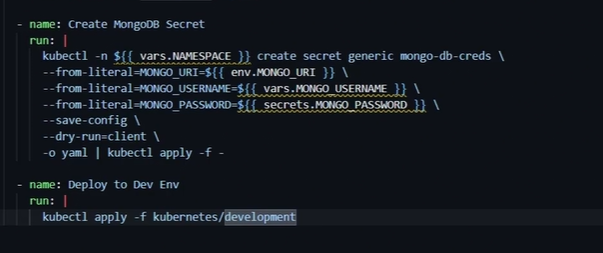

- To test it do anoher job but we need to first get the ingress host like ingress ip and but, 
    - As testing will be in another job we will need to expose the ingress host from the previous step as job output.
    - It requires to set id to the 1st job 

        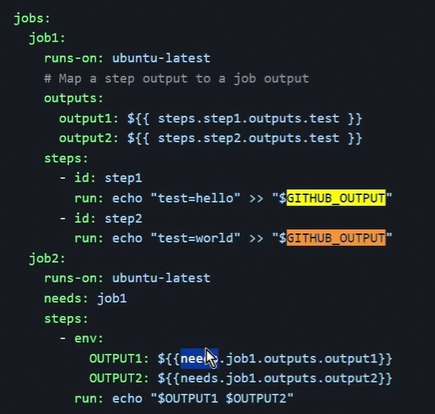

        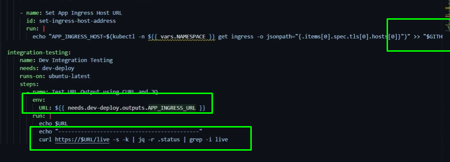

# Environments

- Used to set multi env dev and prod
- Set vars and could be the same var name but one foe dev with dev values like kubeconfig of dev cluster and the othe one for prod like the kubeconfig of the production env.

    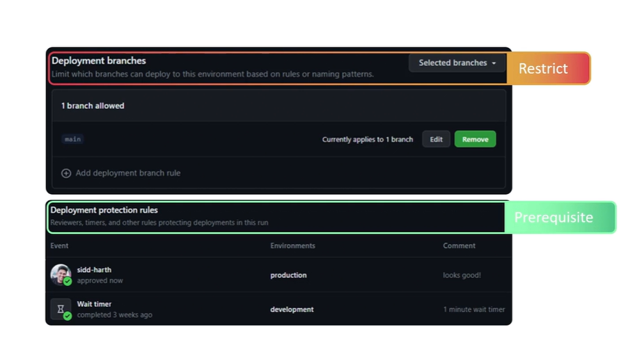

- You can also set rules like:
    - leader approval
    - wait time for making sure all good 

- We can set env vars and secrets like (kubeconfig)

- it takes name and url

    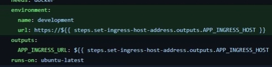
    
    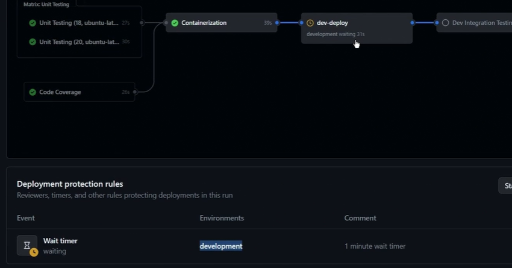

## Custom actions

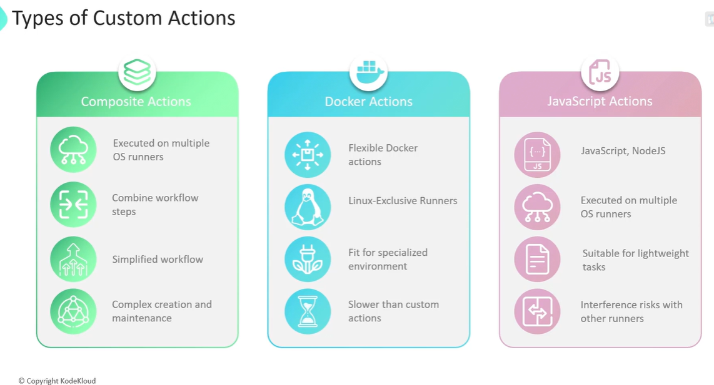

- It's like creating your own module in python
- here you creating your own action in a path likw this under `.github`

    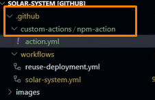

- Also we can package some steps or repeated ones in one action

- It's like variables and fiilling the required fields with these variable 

    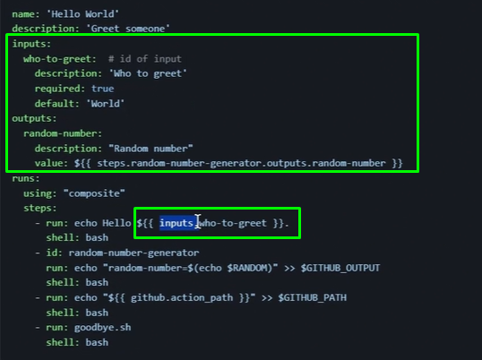

- So you can use this action by copying the `relative path` as the action, 

    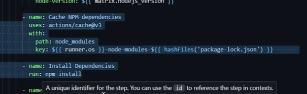

    To this

    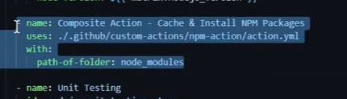

- Specify the shell dep on runner like `shell: bash`

## Docker action

- A docker image for running a REST API reqeust to call `GIPHY` 3rd party.

- Here we will use the following custom action to use `docker` instead of `composit` as the last action.

    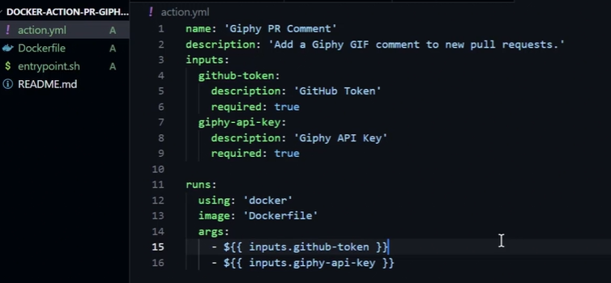

- The args in the end referes to inputs which will be input to the shell script to run inside this container

    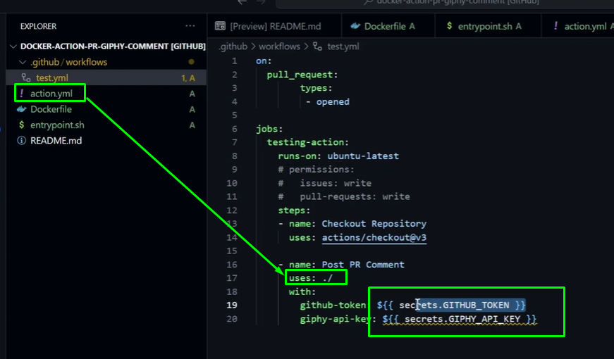

- We can call this custom action from another repo

    `uses: <repo-owner>/<repo>@<branch>`

## Custom action

- You can create a custom action and release it to marketplace

    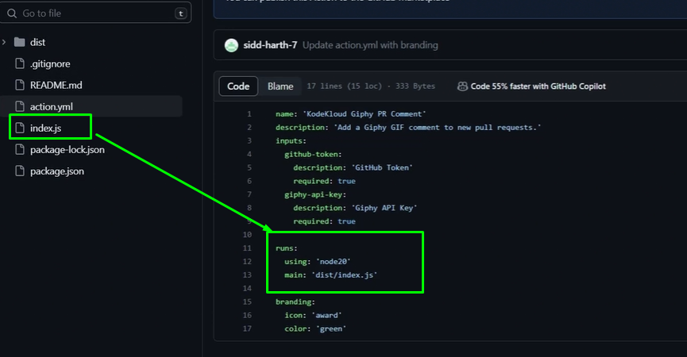

- This action will be used then run the index.js file to do giphy rest api request

    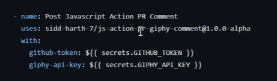

# Runners

- As every ci tools you can have github/self hosted runners

- It can be on enterprise, or, or repo levels

- All running jobs work will be in `_work` dir in home of self-hosted runner

## Re-usable workflows

- As a funtion in programming, we call another workflow
- This another wf is created and triggered with `on.workflow_call`
- call it as we've called custom action

    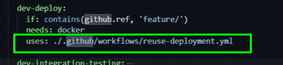

- `Secrets` Some variables and secret may be not be inhireted in the on_call wf, so we will need to inhirt them

    - on the main wf add them

        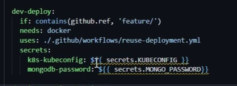
    
    - on the on_call add them ass follows

        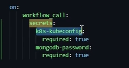

- `Inputs` In the same way of inputting the secrets, we need to input another variables not secrets this time
- These vars are Kube version, environmet (prod, dev) as it referes to dir which contains the yaml files used in deployment

    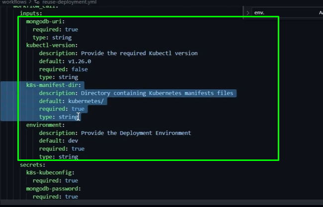

- Then use it in the same reusable wf

    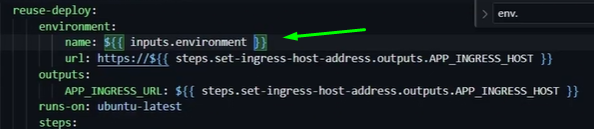

    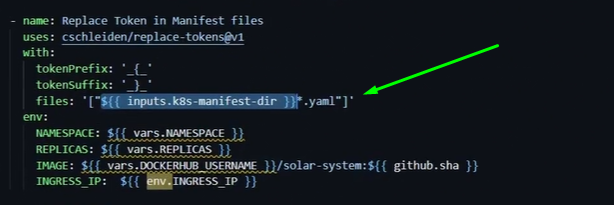

- In the main wf

    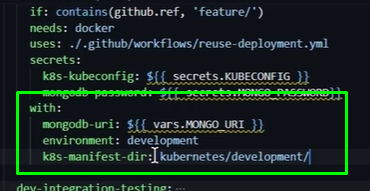

    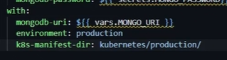

- You'll see mongodb used in run

    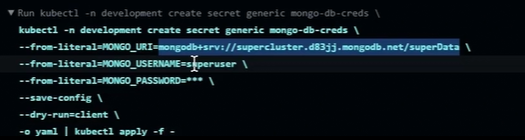

- `Output`. We set output to resuable wf

    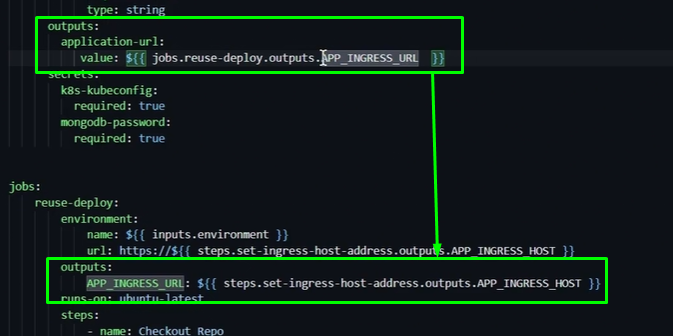

    - USe it in mian wf

        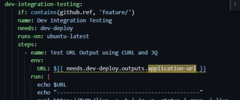

## Reports

- We can donwload artifact like code converage and test, put them in one dir, upload that dir to S3
- We use `s3 Sync`

    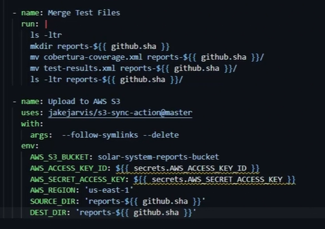

    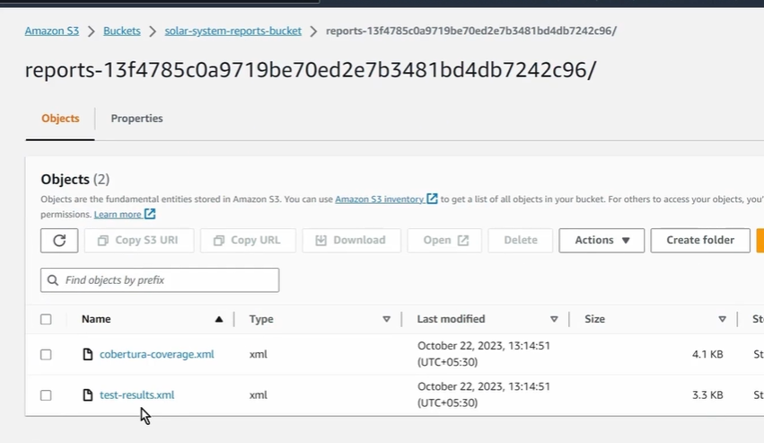

## Slack notify

- Create a channel on slack
- Create an app from docs, which will get you a webhook

    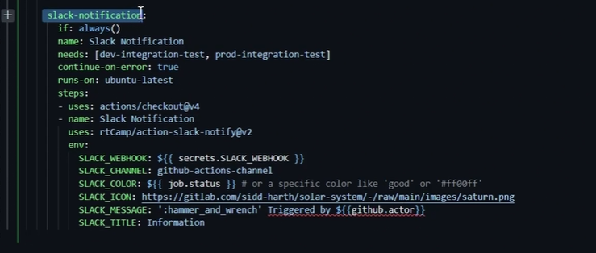

    

- We made it runs `always()` not to depend on another rules

## Security

- You should check the action code first if it's not verified

    

- Sometimes script injection can be very risky
    - when i trigger the wf with an issue creation

       
    
    - then do this to the title of issue

        

- Or using `httpdump` curl to get aws secret key

    

    
    
    

- So how to avoid this??

    - We keep the title in env in memory

    

- You can keep secret in vault and integrat it with github

[](https://github.com/Mohammadabdelaty/github-actions-solar-system/actions/workflows/solar-system-2.yml) 🥲🥲🥲🥲🥲🥲

> How Script Injection Can Happen in GitHub Actions:
Untrusted Input: Using inputs from pull requests, issue comments, or other sources controlled by users without proper sanitization.

Environment Variables: Injecting untrusted data into environment variables that are later used in a script or command.

Workflow Commands: GitHub Actions supports a set of workflow commands (like ::set-env or ::add-path) that can be used to dynamically set environment variables, paths, etc. If an attacker can control the data that gets interpreted as a workflow command, they can alter the behavior of the workflow.

> Mitigation Strategies:
Validate and Sanitize Inputs: Always validate and sanitize user inputs or data fetched from external sources. Be cautious with data from pull requests, especially from forks.

Use Built-in Token and Permissions: GitHub Actions provides a GITHUB_TOKEN with limited permissions by default. Avoid using high-permission personal access tokens if possible.

Limit Workflow Permissions: Explicitly set the permissions for the GITHUB_TOKEN in your workflow to only what is necessary for the tasks at hand.

Avoid Exposing Sensitive Information: Be careful not to echo sensitive information in your logs. Treat all output as potentially visible.

Use Trusted Actions: Prefer actions that are well-maintained, versioned, and from reputable sources. Pin actions to a full length commit SHA to avoid unexpected changes.

Code Reviews: Implement a code review process for changes to workflows to catch potentially malicious changes.

Regular Audits: Regularly audit your workflows and actions for vulnerabilities and keep them updated.

Limit Runner Exposure: For self-hosted runners, ensure they are used only by trusted repositories as they have more access to your network.

Be Aware of Workflow Command Injection: GitHub has deprecated some workflow commands (like set-env and add-path) due to security issues. Always use the latest and safest methods for setting environment variables and paths.

By following these best practices, you can significantly reduce the risk of script injection attacks in your GitHub Actions workflows. Remember that security is an ongoing process, and keeping up to date with GitHub's recommendations and updates is crucial.